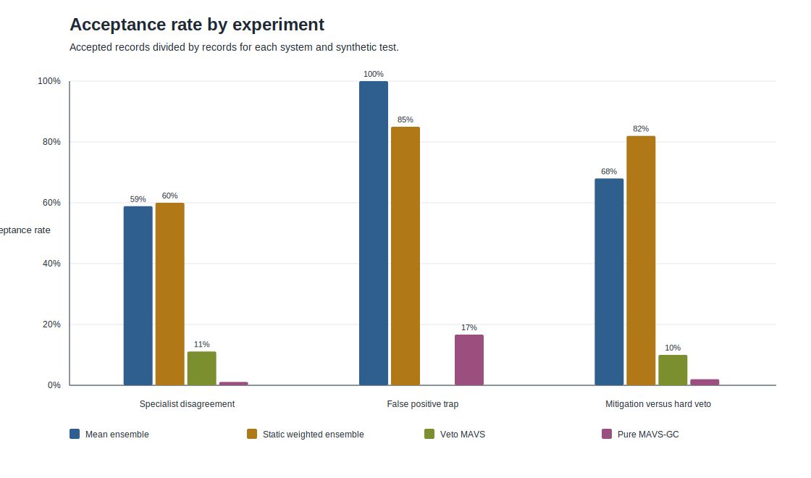
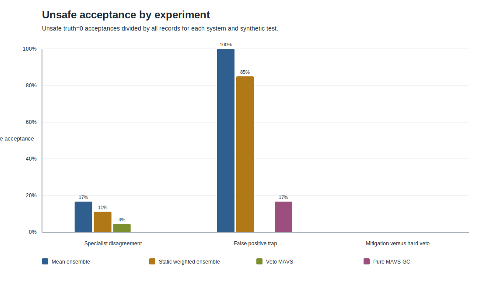
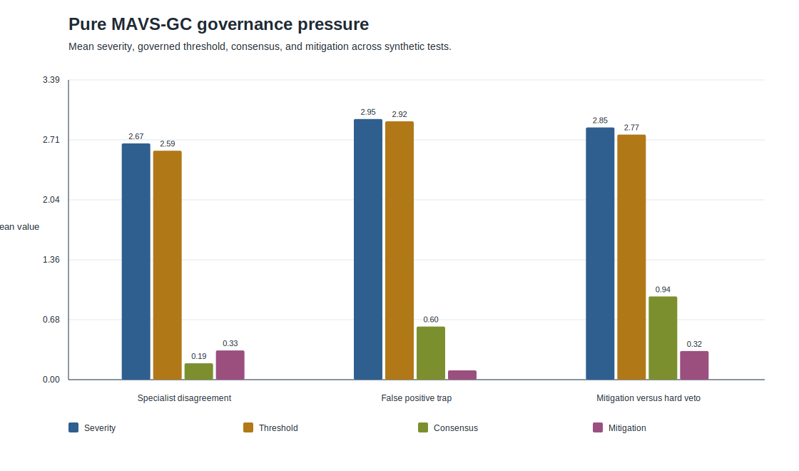
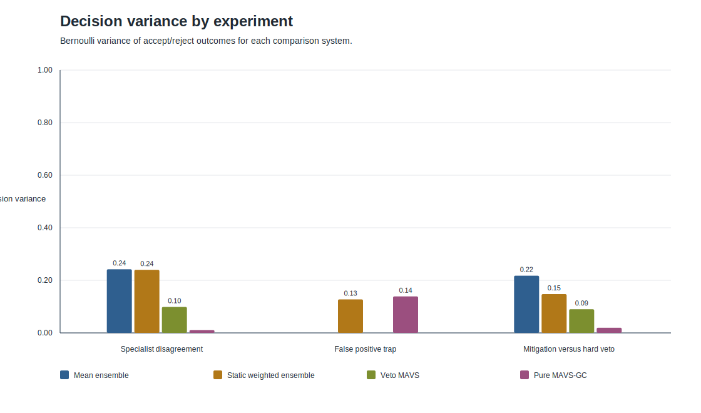
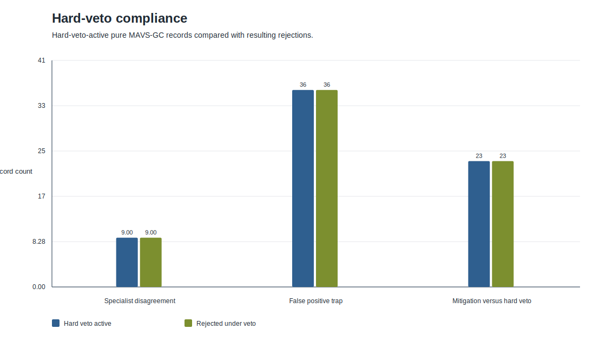

# Chapter 9 Synthetic Benchmark Report

## Technical Summary

This report summarizes the deterministic synthetic benchmark outputs generated for the MAVS-GC Chapter 9 program. The evidence is bounded to synthetic specialists, synthetic cases, and the configured comparison systems; it does not establish real-world model performance.

- In the false-positive trap, pure MAVS-GC accepted 16.7% of unsafe records, compared with 100.0% for the mean ensemble and 85.0% for the static weighted ensemble. Veto MAVS accepted 0.0% under its direct red-flag rule.
- Pure MAVS-GC hard-veto behavior rejected 23 of 23 hard-veto-active mitigation-veto traces, a 100.0% compliance rate in the generated evidence.
- Trace completeness is 100.0% across 1240 generated trace records, using full MAVS-GC field requirements for pure MAVS-GC and explicit reduced trace requirements for baselines.
- The classification results show a safety-pressure tradeoff in the synthetic program: governance-heavy systems reduce unsafe acceptance in trap conditions but reject more truth=1 cases in mitigation-veto settings.

## Key Findings With Visual Evidence

### Acceptance and rejection behavior separate the comparison systems

The acceptance-rate chart shows how often each system accepted records under the three synthetic tests. This is a descriptive comparison of configured systems under controlled synthetic inputs, not a claim about deployment performance.

### Unsafe acceptance concentrates in the false-positive trap

The unsafe-acceptance chart isolates truth=0 cases accepted by each system. In the false-positive trap, the mean and static weighted ensembles accept many unsafe high-confidence cases, while pure MAVS-GC escalates threshold pressure and Veto MAVS applies a direct red-flag rejection rule.

### Pure MAVS-GC exposes governance pressure as traceable quantities

The governance-pressure chart reports mean severity, threshold, consensus, and mitigation for pure MAVS-GC. These quantities correspond to the formal trace semantics: diagnostics feed severity, severity and mitigation determine threshold pressure, and consensus remains separately auditable.

### Decision variance distinguishes mixed behavior from consistent rejection

Decision variance is highest when a system has mixed accept/reject behavior and lower when decisions concentrate on one outcome. This metric supports stability inspection, but it is not a quality score by itself.

### Hard-veto-active traces reject under the generated evidence

The hard-veto chart compares hard-veto-active pure MAVS-GC records with the number rejected. Matching bars indicate that the hard-veto dominance invariant is preserved in these generated traces.

## Scope, Data, and Metric Definitions

The benchmark uses three deterministic synthetic experiments:

- Specialist disagreement: low, medium, and high disagreement regimes.
- False positive trap: unsafe high-confidence consensus cases.
- Mitigation versus hard veto: corruption and mitigation grid cases with hard-veto boundary pressure.

Comparison systems are mean ensemble, static weighted ensemble, Veto MAVS, and pure MAVS-GC. Pure MAVS-GC is the only system that emits the full governance trace containing diagnostics, severity, weights, mitigation, threshold, consensus, policy reason, hard-veto status, and final decision.

Metric definitions are generated in [../results/tables/metric_definitions.csv](../results/tables/metric_definitions.csv), and all result tables are generated from `results/metrics/*.json` and `results/traces/*.jsonl`.

## Results Tables

### Classification Summary

| Experiment | System | Accuracy | Rejection | Unsafe acceptance |
| --- | --- | --- | --- | --- |
| Specialist disagreement | Mean ensemble | 71.1% | 41.1% | 16.7% |
| Specialist disagreement | Static weighted ensemble | 83.3% | 40.0% | 11.1% |
| Specialist disagreement | Veto MAVS | 47.8% | 88.9% | 4.4% |
| Specialist disagreement | Pure MAVS-GC | 46.7% | 98.9% | 0.0% |
| False positive trap | Mean ensemble | 0.0% | 0.0% | 100.0% |
| False positive trap | Static weighted ensemble | 15.0% | 15.0% | 85.0% |
| False positive trap | Veto MAVS | 100.0% | 100.0% | 0.0% |
| False positive trap | Pure MAVS-GC | 83.3% | 83.3% | 16.7% |
| Mitigation versus hard veto | Mean ensemble | 68.0% | 32.0% | 0.0% |
| Mitigation versus hard veto | Static weighted ensemble | 82.0% | 18.0% | 0.0% |
| Mitigation versus hard veto | Veto MAVS | 10.0% | 90.0% | 0.0% |
| Mitigation versus hard veto | Pure MAVS-GC | 2.0% | 98.0% | 0.0% |

Source table: [../results/tables/classification_summary.csv](../results/tables/classification_summary.csv).

### Pure MAVS-GC Governance Summary

| Experiment | Severity mean | Threshold mean | Consensus mean | Mitigation mean | Hard veto rate |
| --- | --- | --- | --- | --- | --- |
| Specialist disagreement | 2.674 | 2.591 | 0.185 | 0.331 | 10.0% |
| False positive trap | 2.950 | 2.923 | 0.601 | 0.105 | 30.0% |
| Mitigation versus hard veto | 2.854 | 2.773 | 0.942 | 0.324 | 23.0% |

Source table: [../results/tables/governance_summary.csv](../results/tables/governance_summary.csv).

Additional generated tables:

- Grouped acceptance: [../results/tables/grouped_acceptance.csv](../results/tables/grouped_acceptance.csv).
- Stability summary: [../results/tables/stability_summary.csv](../results/tables/stability_summary.csv).
- Hard-veto compliance: [../results/tables/hard_veto_compliance.csv](../results/tables/hard_veto_compliance.csv).
- Trace completeness: [../results/tables/trace_completeness.csv](../results/tables/trace_completeness.csv).
- Reproducibility: [../results/tables/reproducibility.csv](../results/tables/reproducibility.csv).
- Chart map: [../results/tables/chart_map.csv](../results/tables/chart_map.csv).

## Methodology and Traceability

Each experiment is generated from its configuration file and fixed seed. Every comparison system evaluates the same synthetic cases and the same all-speak specialist outputs. Baseline traces intentionally remain reduced to their stated decision rules, while pure MAVS-GC traces include the full governance state required by the formal definition.

The run manifest records source hashes, generated artifacts, source hierarchy, seeds, table paths, figure paths, and report-generation scope: [../results/run_manifest.json](../results/run_manifest.json).

## Limitations, Uncertainty, and Robustness Checks

The specialists, case distributions, corruption levels, and mitigation levels are synthetic. The benchmark is appropriate for checking implementation semantics, reproducibility, trace completeness, and controlled failure-mode behavior. It is not evidence that any system will perform better on real-world tasks.

The current experiments also use fixed decision thresholds and fixed synthetic specialist definitions. Future runs should vary governance constants, specialist reliability priors, corruption distributions, and mitigation reliability to test sensitivity before making broader claims.

Robustness checks performed in this phase include automatic report regeneration, source-data checks for every table and figure, metric-definition coverage, trace-completeness checks, and deterministic stress replay of the report builder.

## Recommended Next Steps

1. Add parameter sweeps for `theta_0`, `lambda`, `delta`, and `tau_hard` to test governance sensitivity.
2. Add ablations for each diagnostic flag to measure which governance components drive threshold pressure.
3. Extend the report generator with optional appendix tables once larger stress outputs are promoted from temporary artifacts to stored benchmark outputs.

## Further Questions

- Which diagnostic flags dominate severity under each synthetic failure mode?
- How sensitive are false positives and false negatives to the hard-veto boundary?
- How should synthetic mitigation reliability be varied to separate useful mitigation from unsafe threshold relaxation?
